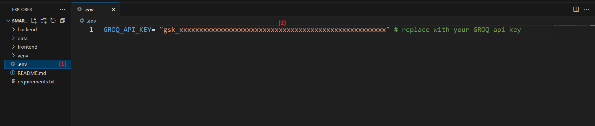

# 🧠 SmartMedReport Dashboard
AI-Powered Medical Report Analysis & Visualization

---

## 🚀 Project Overview

**SmartMedReport Dashboard** is a powerful AI-driven web application designed to streamline the analysis and validation of medical reports and insurance claims. It helps healthcare providers, analysts, and insurers visualize patient journeys, detect unnecessary tests, estimate potential cost savings, and validate medical claims against policy documents.

This full-stack solution combines a responsive frontend dashboard with a FastAPI backend, leveraging **Groq's LLMs** for intelligent insights and automation.

---

## 🧩 Core Technologies & Skills

| Domain             | Tools & Frameworks                                |
|-------------------|----------------------------------------------------|
| **Backend**        | FastAPI, Python 3                                  |
| **Frontend**       | HTML, CSS, JavaScript, Chart.js                    |
| **AI Integration** | Groq API                                           |
| **Data Processing**| JSON-based pipeline                               |
| **Visualization**  | Dynamic charts, condition timelines, cost summaries |
| **DevOps**         | Docker, Conda, Environment Variables               |
| **Deployment**     | FastAPI static file server on port `8081`         |

---

## ✨ Features

### 📊 Medical Test Visualization
- **Interactive charts** showing test results, patient risk scores, and condition timelines.
- Intuitive date filters and dynamic chart updates.

### 🧬 Patient Journey Tracking
- Visual representation of a patient’s health journey from initial diagnosis to current condition.
- Auto-analysis of health trajectory and conditions over time.

### ❌ Unnecessary Test Detection
- AI-backed identification of redundant or irrelevant medical tests.
- Suggested alternatives and cost-saving opportunities.

### 💸 Cost Breakdown & Savings Insights
- Calculates and displays **total cost of unnecessary tests**.
- Itemized view with cost comparison and potential reduction.

### ⚠️ Risk & Fraud Assessment
- Highlights suspicious patterns or test irregularities.
- Assigns a **risk score** based on Groq’s LLM analysis.

### 📑 Claim & Policy Validation
- Validates medical documents against insurance policies.
- Highlights discrepancies between documents with detailed insights.

### 📝 Report Generation & Export
- One-click download of a PDF report with medical summary, cost analysis, and fraud insights.

### 🌐 Full Web Dashboard UI
- Clean and interactive frontend with dropdown filters, popups, and animated loading indicators.
- Responsive layout with sticky navigation and section highlights.

---

## ✅ Prerequisites

Before starting, ensure the following are installed:

- ✅ Python 3.8+  
- ✅ Conda (Recommended for virtual environment)  
- ✅ Docker Desktop (Optional for containerization)  
- ✅ Groq API Key (Required for analysis and validation)

### 🔐 Ports to Allow

- Backend runs on: **`http://127.0.0.1:8080`**  
- Frontend dashboard on: **`http://127.0.0.1:8081`**

Please ensure **ports 8080 and 8081 are available** before running.

---

## ⚙️ Installation & Setup

### 1. Clone the repository
```bash
https://github.com/DaivikM/SmartMedReport_Dashboard.git
cd SmartMedReport_Dashboard
```

### 2. Create and activate a Conda environment
```bash
conda create -p venv python=3.12.9 -y
conda activate venv/
```

### 3. Install Python dependencies
```bash
pip install -r requirements.txt
```

### 4. Configure your Groq API Key
Create and Set your API keys inside .env file:
```python
GROQ_API_KEY = "your_token_here"
```


In the screenshot above, you'll see where to create the .env file and where to add your API keys of Groq

---

### 5. Run the backend (API server)
Terminal 1:

```bash
cd backend
python main.py
```
### OR
## 🐳 Running with Docker (Optional)

If Docker is preferred, you can run the backend via:

```bash
cd backend
docker-compose up -d --build
```
### 6. Run the Frontend
Terminal 2:

```bash
cd frontend
python main.py
```
### 7. Open the frontend dashboard
Visit:
```
http://127.0.0.1:8081
```

---

## 🧪 Troubleshooting

- ❗ **Ports 8080 or 8081 not available?** → Update them in `main.py` or `docker-compose.yml`.
- 🔐 **Groq API issues?** → Ensure your key is active and correctly set.
- 🧾 **No data displayed?** → Make sure the required localStorage keys (`verify-stored`, `analyze-stored`) are correctly set via your workflow.

---

## 📜 License

This project is licensed under the **MIT License**.

You can freely use, modify, and distribute the software with attribution, and without any warranty. See the [LICENSE](LICENSE) file for more details.

---

## 📞 Contact

- 📧 Email: [dmohandm11@gmail.com](mailto:dmohandm11@gmail.com)  
- 💻 GitHub: [DaivikM](https://github.com/DaivikM)

---

## 📚 References

- [FastAPI](https://fastapi.tiangolo.com/)
- [GROQ](https://console.groq.com/docs/api-reference#chat-create)

---

### 🚀 Happy Coding! ✨

🧪 Clone this repository to explore real-time AI-powered Medical Report Analysis and Comparison, using Groq’s LLMs, FastAPI, and an interactive web dashboard for visualizing health insights and insurance policy matching.

---
